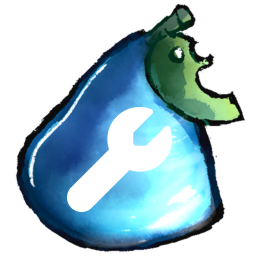

  

<h1 align="center">Metadata</h1>

  This repository contains the metadata used by <a href="https://github.com/CasualtiesManageable/CasualtiesManageable">Casualties Manageable</a> to discover and display mods for <a href="https://store.steampowered.com/app/4576490/Casualties_Unknown/">Casualties: Unknown</a> game.

  
  

---

# ⚠️ Unfinished for now :(
I haven't found a decent way to download mods yet, so I'm not sure if I'll finish this project unless I find one.

## Adding Your Mod

To submit your mod to the launcher, open a **Pull Request** that adds your entry to `mods.json`.

## License

The metadata in this repository is provided under the [MIT License](LICENSE).  
Each mod is subject to its own license as specified by its author.
