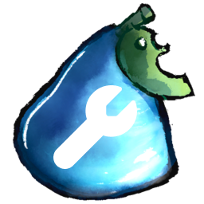

<p align="center">
  
</p>
<h1 align="center">Metadata</h1>

<p align="center">
  This repository contains the metadata used by several mod managers for the <a href="https://store.steampowered.com/app/4576490/Casualties_Unknown/">Casualties: Unknown</a> game, as well as Shields.io badges.
</p>


---
This repo serves as an automatic updater for `nexusmods.json` and static Nexus download badges.

Both files are refreshed automatically from the Nexus Mods API every hour.

---
`nexusmods.json` contains the full metadata for the current mods on Nexus. Every file in `badges/` is a complete Shields endpoint response with the Nexus Mods icon embedded.

See [https://discord.gg/ehCptz9pwU](https://discord.gg/ehCptz9pwU) for an announcement channel for new mod listings and mod updates, using this metadata!

Badge files use the normalized Nexus mod name: lowercase, with words separated by hyphens. For example, CUCoreLib is `badges/cucorelib.json`:

```md
[](https://www.nexusmods.com/scavprototype/mods/341)
```
<center>

[](https://www.nexusmods.com/scavprototype/mods/341)</center>


## License

The metadata in this repository is provided under the [MIT License](LICENSE).  
Each mod is subject to its own license as specified by its author.
